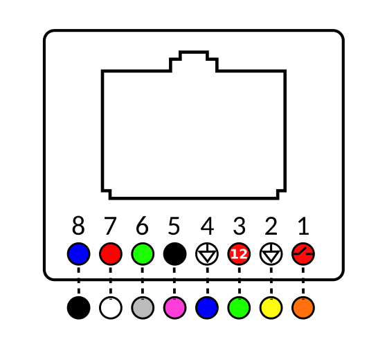
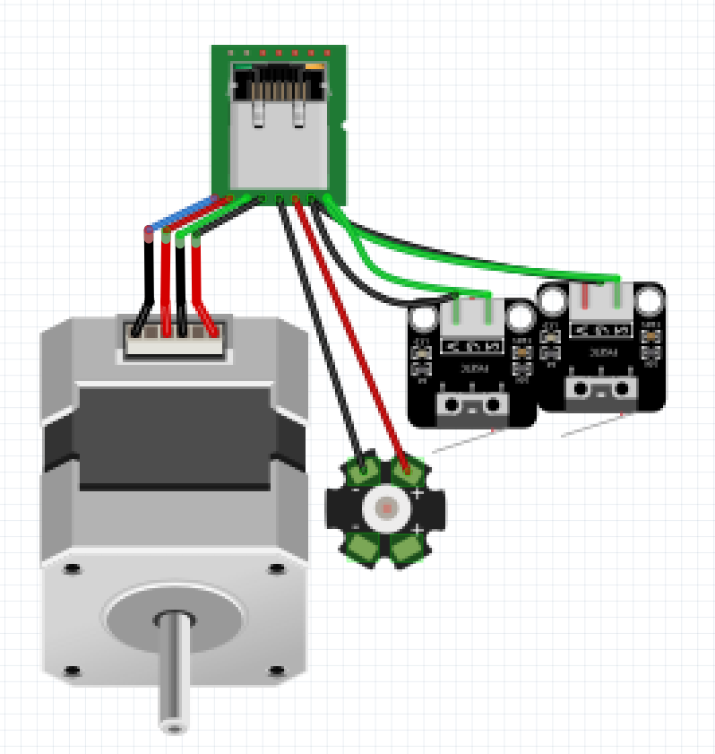

# main repository for the stepper thing

Main pin mapping and debugging tools for the stepper thing

### Arduino Mega Shield

#### Switches

| Yellow |   GND  |
|:------:|:------:|
|   sw1  | pin 10 |
|   sw2  | pin 11 |
|   sw3  | pin 9 |
|   sw3  | pin 8 |

#### LEDS

| Channel | MOSFET |
|:-------:|:------:|
|    4    |    1   |
|    2    |    2   |
|    1    |    3   |
|    3    |    4   |

#### STEPPER pin mapping

|   | STEP | DIR |
|:-:|:----:|-----|
| **X** |  52  | 34  |
| **Y** |  50  | 40  |
| **Z** |  48  | 38  |
| **A** |  46  | 36  |

#### SERIAL COMMANDS

|     | LEFT | RIGHT |
|:---:|:----:|:-----:|
|  **X**  |   q  |   w   |
|  **Y**  |   a  |   s   |
|  **Z**  |   r  |   t   |
|  **A**  |   f  |   g   |
| **ALL** |   v  |   b   |

#### ETHERNET CLIENT PIN mapping

